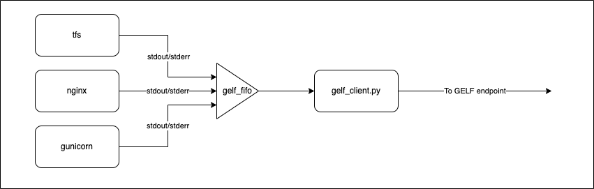

# Logging sagemaker output to GELF endpoints

Amazon SageMaker enables customer to build, train, and deploy machine learning (ML) models for any use case with fully managed infrastructure, tools, and workflows

As a fully managed service it is tightly integrated with with other AWS services including Cloudwatch for logging. Occasionally customers have their own logging infrastructure that they would like to use, for example when migrating to Sagemaker from their existing infrastructre. This repository takes the MNIST Tensorflow example from the [Sagemaker examples](https://github.com/aws/amazon-sagemaker-examples/tree/main/frameworks/tensorflow) and demonstrates how to forward logging data directly from a Sagemaker endpoint to a GELF compatible logging endpoint.

We will modify the base Sagemaker [tensorflow serving container](https://github.com/aws/sagemaker-tensorflow-serving-container) and use the [pygelf](https://pypi.org/project/pygelf/) module to format and send data to the GELF compatible endpoint. In addition we make use of the [reredirect](https://github.com/jerome-pouiller/reredirect) utility to intercept and duplicate the stdout and stderr of processes running within the container so that those streams can also be forwarded to the GELF compatible endpoint.  

## What happens when an Endpoint is created?
When Sagemaker creates an endpoint, it essentially runs a container on the requested instance type. For Tensorflow, this is the Sagemaker Tensorflow serving container. The container starts up NGINX and gunicorn to serve a REST API endpoint providing /inference and /ping paths. When a request is made to /inference it is handled by code in container which calls user supplied handler function(s). The location of the code for these user supplied handlers (usually inference.py) is passed to Sagemaker when the model is created.

## How do we forward the logs?

To capture the output of the processes which are spawned by serve.py, we need to capture their stdout and stderr streams. Before starting serve.py we modiy the serve bash script to create a named fifo, /sagemaker/gelf_fifo. Named fifos are special files on the filesystem which use a memory buffer (Linux default size is 64KB) to implement a fifo. The fifo can be opened for write at one end and opened for read at the other, providing a mechanism for inter-process communication.

Once we have the named fifo, we spawn gelf_client.py to loop round, read from the fifo, forward all messages to the gelf endpoint via the pygelf module and then sleep for a while before checking the fifo again.

To avoid our gelf client blocking the main worker processes we renice it to a lower OS task priority.

Next we start running serve.py

To capture the stdout/stderr streams we use the reredirect utility. After serve.py spawns each process it makes a call to reredirect with the process ID (PID) of the newly spawned process and redirects its stdout and stderr to /sagemaker/gelf_fifo.

## Try it out

The notebook get_started_mnist_deploy.ipynb shows how to build the extended docker container and use it to forward messages to a GELF compatible endpoint. 

## Test endpoint
 See the separate README.md file in the test subdirectory

# Capturing and modifying CustomAttributes in inference.py

The container also includes a couple of modifications to support reading and modifying the CustomAtttributes header in the incoming request. CustomAttributes can be set when using the [invoke_endpoint](https://boto3.amazonaws.com/v1/documentation/api/latest/reference/services/sagemaker-runtime.html#SageMakerRuntime.Client.invoke_endpoint) API boto3 SDK.

In the standard container, CustomAttributes are copied from the the request header and added to the context which is passed into the handler function in inference.py.

In this modified version, python_service.py has been updated to pass the [request and response](https://falcon.readthedocs.io/en/stable/api/request_and_response_wsgi.html) objects into the handler function as well as the context. The handler fuction can then use these extra objects to directly access the CustomAttributes in the request and to update CustomAttributes in the 'X-AMZN-SAGEMAKER-CUSTOM-ATTRIBUTES' header of the repsonse.

Note that non-Sagemaker headers will be stripped out of the response, so to pass additional information back to the client calling invoke_endpoint() it must be added to the CustomAttributes.

